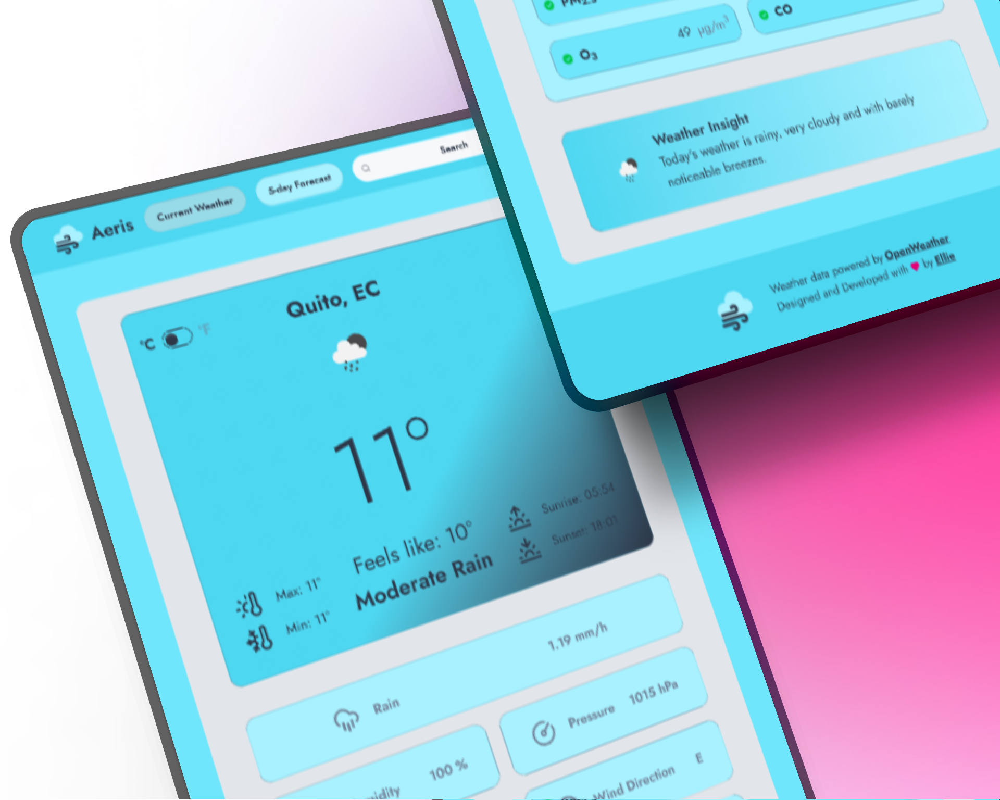
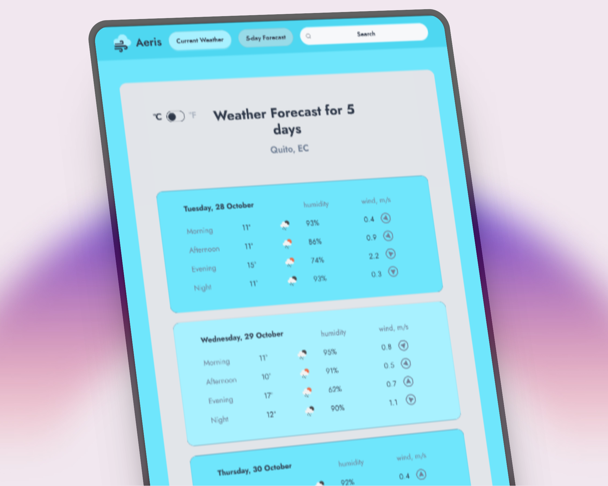
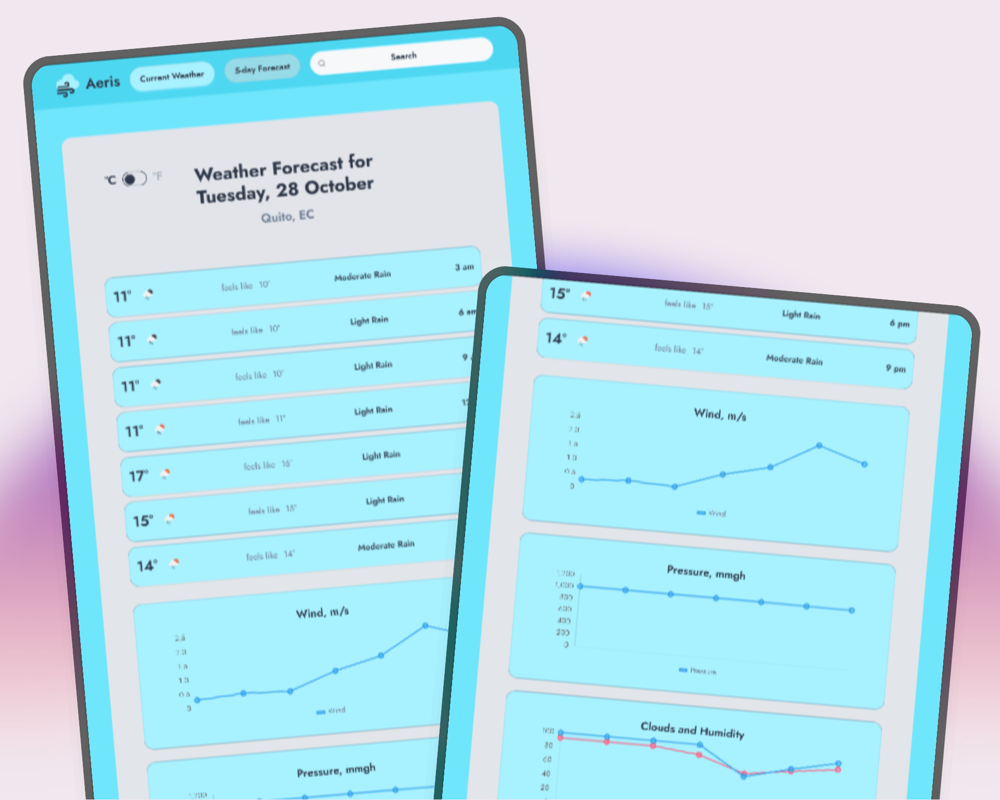
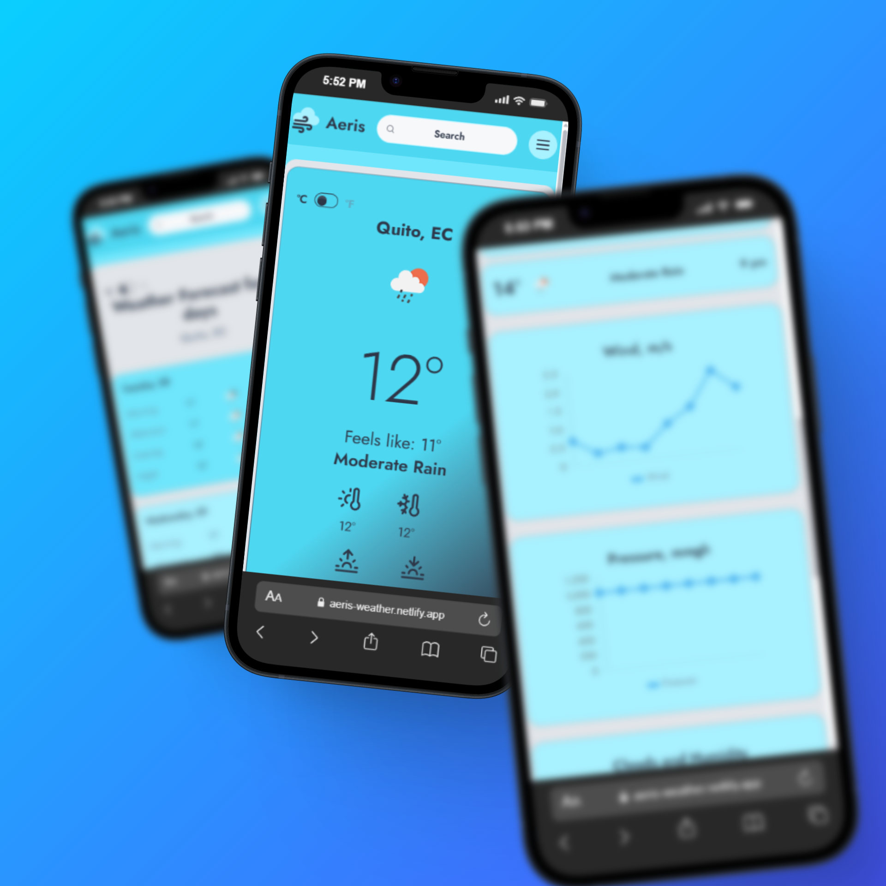

<h1 align="center">Aeris - Weather Web Page</h1>

  

 

## Description

Aeris Weather is an open-source webpage dedicated to provide accurate weather and forecast.

Our clean, modern and user-friendly web offer a visual appealing experience for check weather information anywhere worldwide.

**[✨ Check the website here](https://aeris-weather.netlify.app/)**

## Web Content

#### 🌤️ Current Weather

Check temperature, humidity, wind metrics and aditional information about the weather of your current location. Explore the air quality, pollutants, composition of the air and weather insight based on measured weather conditions.

  

#### 🌦️ 5 Day Weather Forecast

Get a comprehensive look at the weather for the next 5 days. This includes daily high and low temperatures, and a summary of the expected weather conditions, helping you plan your week ahead.

  

#### 🖋️ 3 Hours Forecast Details

Dive into the specifics with a detailed forecast broken down into 3-hour intervals for the selected forecast for the day. Track changes in temperature, wind speed, cloudiness, humidity and more through intuitive, easy-to-read charts.

  

#### 📱 Adaptive Interface

Aeris features a fully responsive design that looks and works great on any screen size. Enjoy a seamless weather-checking experience whether you're on a desktop, tablet, or mobile device.

  

## 💻 Tech Stack

- [![Angular][angular-badge]][angular-url] - A component-based framework for building scalable web applications
- [![Tailwind][tailwind-badge]][tailwind-url] - A utility-first CSS framework for rapidly building custom designs.

- Weather data powered by **[Openweather](https://openweathermap.org/)**

<!-- Repository Links -->

[angular-badge]: https://img.shields.io/badge/Angular-fff?style=for-the-badge&logo=angular&logoColor=fff&color=E82B69
[tailwind-badge]: https://img.shields.io/badge/Tailwind-fff?style=for-the-badge&logo=tailwindcss&logoColor=fff&color=00bcff

<!-- Repository Links -->

<!-- Tech Stack Links -->

[angular-url]: https://v19.angular.dev/
[tailwind-url]: https://tailwindcss.com/

<!-- Tech Stack Links -->
